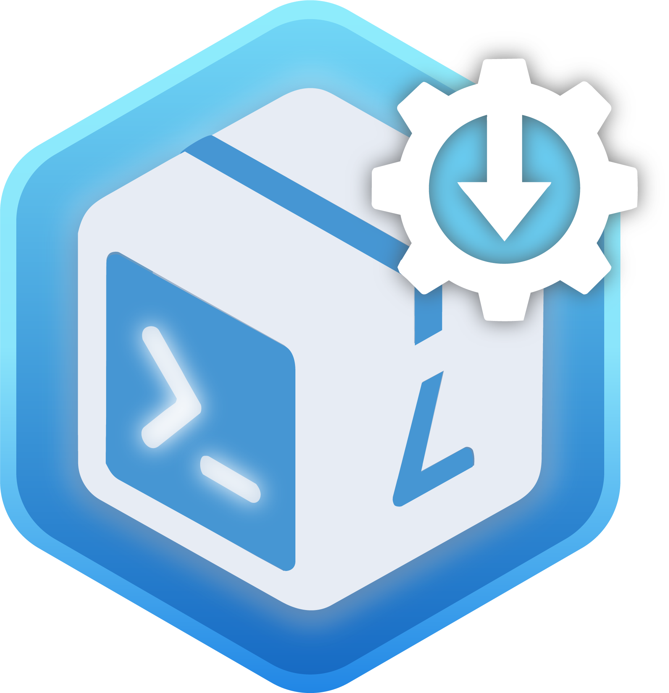

<div align="center">
  
  <h1>WSLCC</h1>
  <p>Windows 上的 WSL 容器（wslc）桌面管理器</p>
  <p>基于微软官方 WSL Container API 与 wslc CLI，提供镜像、容器、Compose 编排、卷、日志的图形化管理。</p>
</div>

## 特性

- 仪表盘：环境状态、资源配额、活动会话
- 容器：列表、资源统计、启停/删除、打开端口网址、日志
- 编排：Compose 项目部署、编辑、重建、停止、删除
- 镜像：查看、删除、拉取记录
- 卷：挂载卷管理
- 日志与审计：容器日志查看、操作留痕
- 设置：会话、镜像加速、外观

## 环境要求

- Windows 10/11（x64）
- [WSL 容器（wslc）](https://github.com/MicrosoftDocs/wsl/blob/main/WSL/wsl-container.md)（微软官方 WSL 容器 CLI）
- .NET 10 SDK（开发构建）

## 构建

```powershell
powershell -ExecutionPolicy Bypass -File build.ps1
```

## 打包发布

```powershell
powershell -ExecutionPolicy Bypass -File publish.ps1
```

产物为自包含单目录 `dist\WSLCC-<版本>-win-x64.zip`，解压即可运行，无需安装运行时。

推送 `v*` 标签会触发 GitHub Actions 自动构建并创建 Release。
