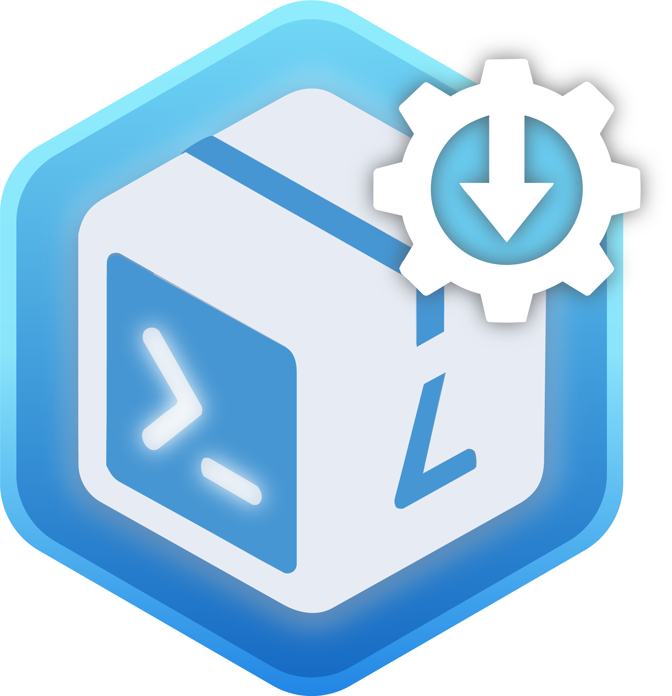

<div align="center">
  
  <h1>WSLCC</h1>
  <p>Windows 上的 WSL 容器（wslc）桌面管理器</p>
  <p>基于微软官方 WSL Container API 与 wslc CLI，提供镜像、容器、Compose 编排、卷、日志的图形化管理。</p>
</div>

## 特性

- 仪表盘：环境状态、资源配额、活动会话（可一键打开会话终端）
- 容器：列表（自动抓取网页图标）、资源统计、启停/重启/删除、打开端口网址、日志（尾行数/时间戳/时间范围）、详情、终端、文件复制（可选跟随符号链接）、创建（含卷/挂载、环境、健康检查、网络别名、资源限制等）
- 编排：Compose 项目部署、编辑、重建、停止、删除；部署进度可视化（分步进度 + 日志），支持复用本地镜像或强制拉取最新
- 镜像：查看（可显示摘要、中间层）、删除、拉取记录、详情、清理未使用、全标签拉取
- 卷：挂载卷管理、清理未使用
- 网络：查看、创建、删除、连接/断开容器、详情、清理未使用
- 事件：容器与网络生命周期事件（历史查询与实时监听）
- 资源清理：容器/镜像/卷/网络一键 prune
- 日志与审计：容器日志查看、操作留痕
- 迷你面板：托盘左键唤出右下角浮层，快速查看容器状态、启停/重启、打开端口、启停 wslc 会话，支持下拉手势收起
- 错误反馈：一键复制诊断信息并跳转 GitHub 新建 issue
- 设置：会话（写入官方 wslc settings.yaml）、镜像加速、外观（主题色 / 背景材质）、启动时最小化到托盘，采用 Windows 11 设置式分组卡片
- 内存优化：隐藏到托盘后释放主窗口页面，工作集可降至约 40 MB

## 环境要求

- Windows 10/11（x64）
- [WSL 容器（wslc）](https://github.com/MicrosoftDocs/wsl/blob/main/WSL/wsl-container.md)（微软官方 WSL 容器 CLI，现已正式发布，需 `wsl --update`）
- .NET 10 SDK（开发构建）
- 分离版额外需要：.NET 10 桌面运行时 与 Windows App Runtime 2.4（合并版无需）

## 构建

```powershell
powershell -ExecutionPolicy Bypass -File build.ps1
```

首次构建会自动下载 `Microsoft.WSL.Containers` SDK 包到 `nuget-packages/`（该包仅随 microsoft/WSL 的 GitHub Release 发布，不在 nuget.org）。也可手动执行 `scripts/fetch-wslc-sdk.ps1`。

## 打包发布

提供两种发布模式：

- **合并版（自包含）**：内置 .NET 运行时，开箱即用，体积较大。
- **分离版（框架依赖）**：不含运行时，体积小，需系统已安装 .NET 10 桌面运行时与 Windows App Runtime 2.4。

```powershell
# 合并版（默认）
powershell -ExecutionPolicy Bypass -File publish.ps1

# 分离版（框架依赖）
powershell -ExecutionPolicy Bypass -File publish.ps1 -Framework
```

产物为自包含/框架依赖单目录 zip，解压即可运行。加 `-InnoSetup` 可一并生成对应安装器。

推送 `v*` 标签会触发 GitHub Actions 自动构建并创建 Release，产物包括：

- 合并版：`WSLCC-win-x64.zip`、`WSLCC-Setup.exe`
- 分离版：`WSLCC-win-x64-framework.zip`、`WSLCC-Setup-framework.exe`

应用内置自更新流程，检测到新版本后按当前安装模式下载对应安装包并自动完成替换升级。

## 贡献者

- [lemonno2333](https://github.com/lemonno2333) - 应用图标设计
- [DSUK](https://github.com/iwvw) - 项目开发

## 友情链接

- [Linux.do](https://linux.do) - 技术社区

## 许可证

本项目采用 [MIT License](LICENSE)。
